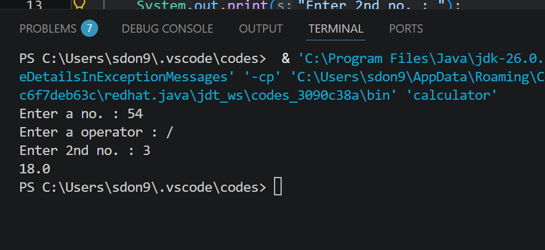

# Java-Calculator
Simple calculator project made using Java while learning programming fundamentals. Supports basic arithmetic operations and user input through terminal.

A basic calculator built using Java.
This project performs:

* Addition(+)
* Subtraction(-)
* Multiplication(*)
* Division(/)
* Modulus(%)

Concepts used:

~ Scanner class
~ Operators
~ Conditional statements
~ User input handling

Built while learning Java basics.

